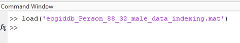
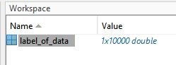

# Robustness-of-Electrocardiogram-ECG-Signal-Quality-Indices

## Step-1: Download all data from the given link and extracted zip file.

- ECG-ID dataset: https://physionet.org/content/ecgiddb/1.0.0/
- Tele ECG dataset: https://dataverse.harvard.edu/dataset.xhtml?persistentId=doi%3A10.7910%2FDVN%2FQTG0EP&version=&q=&fileAccess=&fileTag=&fileSortField=&fileSortOrder=
-  BIDMC Dataset: https://physionet.org/content/bidmc/1.0.0/
- MIT/BIH arrhythmia dataset: https://physionet.org/content/mitdb/1.0.0/
- CINC 2011 dataset: SET_a: https://physionet.org/content/challenge-2011/1.0.0/
- CINC 2014 dataset: set_p: https://physionet.org/content/challenge-2014/1.0.0/

## Step-2:  Download and extracted zip file from this repository
- Load .mat file in matlab
    -   Example for BIDMC datasets
    -   
    -    
- There are one array:
    - label_of_data,[ binary array with zeros and ones]
    - Zero means noise-free ECG and ones means noisy ECG data
---
## Step-3: Read the file from step-1 data folder according to the Step-2 data folder and subject name
---
## If you find it is useful and used for publication. Please kindly cite our work as:
### Bibtex version
```latex
@article{rahman2022robustness,
  title={Robustness of electrocardiogram signal quality indices},
  author={Rahman, Saifur and Karmakar, Chandan and Natgunanathan, Iynkaran and Yearwood, John and Palaniswami, Marimuthu},
  journal={Journal of the Royal Society Interface},
  volume={19},
  number={189},
  pages={20220012},
  year={2022},
  publisher={The Royal Society}
}

```
### Plain version

